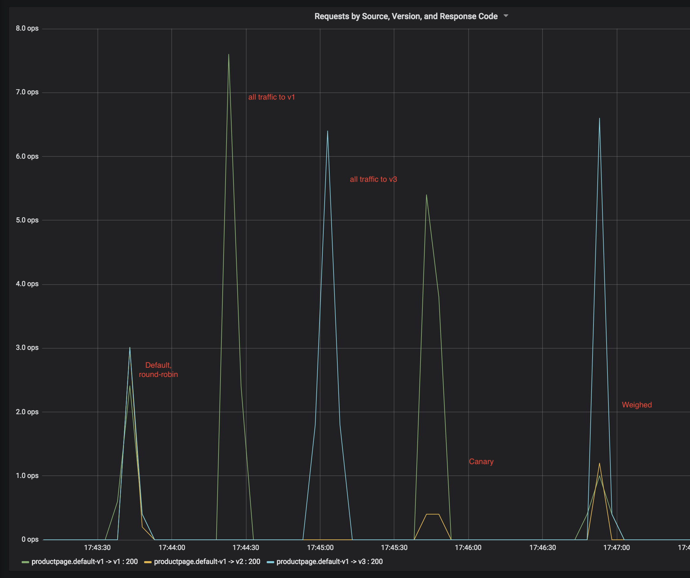

# Tools & Resources
1. Stackpoint.io
2. Istio 0.8 on a K8s cluster, [install via Stackpoint.io web app](https://stackpoint.io/clusters/new?solution=istio). 
3. `istioctl`, [installation instructions](https://istio.io/docs/setup/kubernetes/quick-start/#download-and-prepare-for-the-installation)
4. [newcluster.sh](newcluster.sh) to quickly enable **kubeconfig**   

# Steps

1. Download and enable **kubeconfig** file, automatically generated by Stackpoint.io. 
2. `sh newcluster.sh` 
3. `kubectl get nodes` 
5. `kubectl apply -f istio-0.8.0/samples/bookinfo/kube/bookinfo.yaml`
6. Define ingress gateway, `istioctl create -f istio-0.8.0/samples/bookinfo/routing/bookinfo-gateway.yaml`
7. `kubectl get pods`
7. Let's generate some traffic, `curl -o /dev/null -s -w "%{http_code}\n" "http://$IP_ADDRESS/productpage?[1-50]"`

## Route all traffic to reviews-v1
Write `.yaml`

5. Route all traffic to v1 of microservice, `istioctl create -f istio-0.8.0/samples/bookinfo/routing/route-rule-all-v1.yaml`

## Route all traffic to reviews-v3
This time, we use `update`

6. Route all traffic to v3, `istioctl replace -f istio-0.8.0/samples/bookinfo/routing/route-rule-reviews-v3.yaml`

## Canary Deployment
Normally, we could follow the [instructions here]( https://istio.io/docs/tasks/traffic-management/request-routing/), or write our own `.yaml`. We'll [use the Stackpoint.io UI](https://stackpoint.io).   

 make sure to remove the *reviews* `virutal-service` from when we routed all traffic to *reviews-v1*

## Distribute load across all 3 versions
Use the sliders to set weights of 70, 20, and 10 across *reviews* versions. 

Go ahead and try it. And remember to remove the previous `virtual-service`.

### Screenshot, Grafana - `reviews.default.svc.cluster.local`

### Additional References
- *bookinfo*, https://istio.io/docs/guides/bookinfo/
- `istioctl`, https://istio.io/docs/reference/commands/istioctl/
